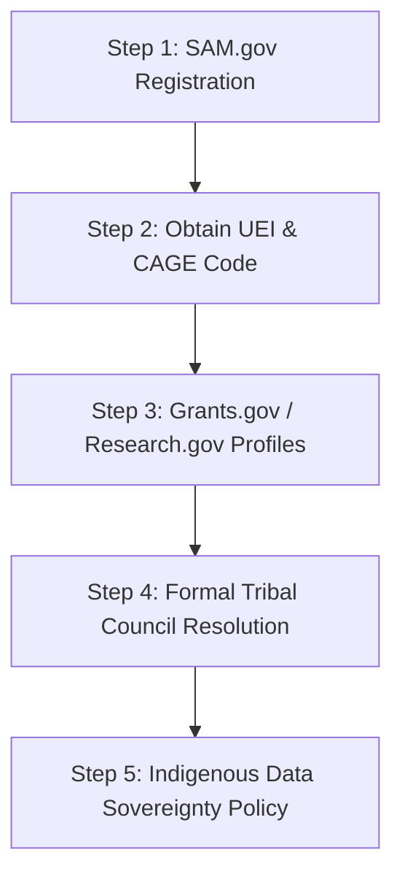

# Master Operational Playbook: Grant Application Procedures for Native American Campus AI Infrastructure

This document outlines the step-by-step procedures required for Tribal Nations, Tribal Colleges and Universities (TCUs), Native-Serving Institutions (NASNTIs), and K-12 Tribal/BIE schools to qualify, prepare, submit, and acquire grant funding for on-campus AI servers and STEM infrastructure.

---

## Phase 1: Prerequisites & Mandatory System Registrations

Before submitting any federal, state, or private grant application, the institution or Tribal entity must complete these foundational administrative steps.

### Step 1: SAM.gov Registration (System for Award Management)
1. Visit [SAM.gov](https://sam.gov).
2. Create an account for the Entity Administrator.
3. Submit entity validation documents (Employer Identification Number / EIN, official tribal address, legal organization charter).
4. **Timeline**: 2 to 4 weeks. Registrations must be renewed annually.

### Step 2: Obtain UEI (Unique Entity Identifier) & CAGE Code
* The SAM.gov process automatically assigns a 12-character alphanumeric **UEI** (replacing the legacy DUNS number) and a 5-character **CAGE code**.
* **Crucial Note**: Ensure the entity name on SAM.gov matches your bank account and IRS 501(c)(3) / Tribal Government tax letter exactly.

### Step 3: Grants.gov & Research.gov Account Setup
* **Grants.gov** (All Federal Agencies): Create an Authorized Organization Representative (AOR) account and link it to your institution's UEI.
* **Research.gov** (NSF Proposals): Create a Principal Investigator (PI) account for your project lead and associate it with your TCU's NSF Organization ID.

### Step 4: Secure a Formal Tribal Council Resolution / Executive Authorization
* Most federal (DOE, USDA, NTIA) and state grants serving Tribal lands require an official **Tribal Council Resolution** or Executive Proclamation endorsing the AI server project and designating the lead applicant.
* **Pro-Tip**: Begin drafting the resolution 4 to 6 weeks before grant deadlines, as Tribal Council voting schedules are fixed.

### Step 5: Establish an Indigenous Data Sovereignty & Governance Policy
* Draft a 2-page institutional policy statement confirming that all AI models trained on campus and all sovereign tribal data stored on the funded server hardware remain 100% owned by the Tribal Nation, protected from unauthorized external commercial exploitation.

---

## Phase 2: Technical Design & Vendor Procurement Quotes

Grant reviewers require itemized, realistic budget justifications backed by formal vendor price quotes.

### Step 1: Define Technical Server Requirements
Determine whether your campus requires:
- **K-12 AI Lab Server**: Dual RTX 4090 / RTX 6000 workstations ($12,000 - $25,000).
- **TCU Academic Compute Server**: 4x NVIDIA L40S or RTX 6000 Ada GPU Server ($35,000 - $75,000).
- **Advanced Research Cluster**: 4x/8x NVIDIA H100/A100 Enterprise Rack ($120,000 - $350,000).

### Step 2: Solicit Vendor Quotes from Approved Contractors
* Request formal quote packages from authorized GSA Schedule or Educational reseller partners (e.g., Dell Federal, HPE, Lenovo, Lambda Labs, Exxact, or NVIDIA Elite Partners).
* Ensure the quote includes:
  1. Base Server Chassis & Enterprise GPUs
  2. NVMe Storage Arrays & High-Speed Switches (10GbE / 100GbE)
  3. Uninterruptible Power Supply (UPS) & Rack Enclosure
  4. 3-Year to 5-Year On-Site Hardware Warranty & Technical Support

---

## Phase 3: Crafting the Proposal Narrative

A winning STEM/AI grant proposal must clearly articulate educational, research, and community impact.

### Key Proposal Sections & Content Guidance

#### 1. Executive Summary & Statement of Need
* Highlight the current digital divide and lack of high-performance compute access in rural/reservation communities.
* Explain why cloud computing alone is insufficient (e.g., high internet latency, recurring cloud subscription costs, data sovereignty concerns).

#### 2. Project Goals & Curriculum Integration
* Detail specific courses that will use the AI server (e.g., CS 101: Intro to AI, GIS 202: Environmental Remote Sensing, LING 301: Native Language AI Preservation).
* Specify metrics for Native student participation, degree completion, and STEM workforce placement.

#### 3. Data Sovereignty & Cyber-Infrastructure Plan
* Detail physical room security (keycard access, climate control, fire suppression).
* Outline cybersecurity measures (firewalls, encrypted NVMe drives, role-based access control).

#### 4. Detailed Budget & Budget Justification
* Present line-item expenses divided into:
  - **Direct Equipment Costs** (GPUs, Servers, Switches, Racks)
  - **Personnel & Stipends** (Faculty PI effort, IT Administrator hours, Student Assistant stipends)
  - **Indirect Costs / F&A Rate** (Include official Negotiated Indirect Cost Rate Agreement / NICRA if applicable).

---

## Phase 4: Submission & Post-Award Management

### Step 1: Submission Verification
* Submit application via Grants.gov or Research.gov at least **48 hours prior to deadline** to avoid portal congestion errors.
* Verify receipt of automated confirmation emails containing tracking numbers (e.g., `GRANT13456789`).

### Step 2: Peer Review & Award Notification
* Federal review cycles take 3 to 6 months.
* If a site visit or clarification request is issued by the Program Officer, respond within 5 business days.

### Step 3: Equipment Procurement & Reporting
* Upon receipt of Notice of Award (NOA):
  1. Execute purchase orders with vendor using grant account code.
  2. Tag all hardware with federal/state asset inventory labels.
  3. Submit annual progress reports (RPPR) and financial reports (SF-425) on schedule.
